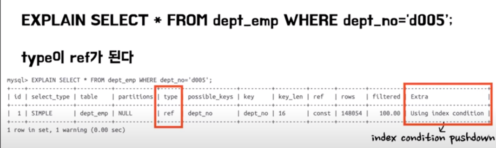

https://www.youtube.com/watch?v=usEsrsaSSuU

# 실행 계획 확인 방법

```SQL
EXPLAIN
EXPLAIN FORMAT = TREE
EXPLAIN ANALYZE...
```

왜 확인하는지?
우리 의도대로 MYSQL이 동작하는지 검사
성능 병목이 있는 부분을 확인 (인덱스, 쿼리, 시스템 변수 등)


Type 
const ?
어떤 테이블의 PK를 사용해서 검색하는 경우 (where id = 1)
ref ? 인덱스를 사용한 동등 비교 (PK, UNIQUE NOT NULL 아님)


부서-사원 테이블에서 부서 번호가 'd005'인 레코드 검사


range ?
범위 검색 사용하는 경우 


eq_ref, ref ?
테이블의 PK 혹은 UNIQUE NOT NULL (인덱스가 하나로 특정되는 경우) 컬럼과 동등 비로 JOIN 되는 경우 


위에 있는 항목들은 인덱스를 타는 경우

INDEX(Index Full Scan), ALL인 경우는 아닌 경우

INDEX(Index Full Scan) ?

조건이 몇개 안남은 경우나 Covering Index를 타는 경우는 괜찮지만 이외엔 좋지 않은 쿼리.

인덱스가 걸려져 있는 컬럼만 조회 시 커버링 인덱스가 탐.

현재는 속도가 5배 차이지만 경우에 따라선 더 크게 날수 있음.


실행 계획 수립은 가격이 싼 작업이 아니다.
MySQL은 수립한 실행 계획을 커넥션 내에서만 캐싱한다.
옵티마이저는 직접 인덱스를 탐색해 샘플링한다(Index Dive)
다양한 조합에 많은 인덱스를 사용하는 통계는 위험하다.
WHERE Col1 in (1,2,3,4,5) and Col2 in (1,2,3,4,5)...

