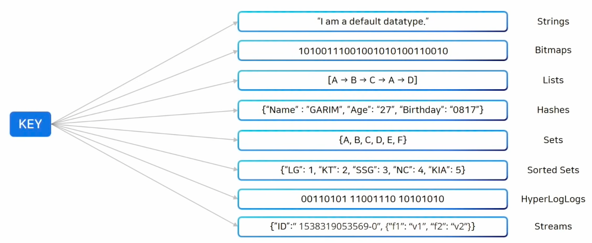

# Redis
- in-memory 데이터베이스로 read/write가 빠른 NoSQL
- key-value 형태로 데이터를 저장해서 별도의쿼리 없이 key로 value를 찾을 수 있다.
- Single Thread로 원자성(Atomic)을 보장하기 때문에 Race Condition 발생가능성이 낮다.
- 마스터-슬레이브 아키텍쳐를 사용해서 비동기식 복제지원 -> 슬레이브 서버에 복제될 수 있어서 분산지원
- 데이터구조(Collection) : String, List, Set, Sorted Set, Hash


http://redisgate.kr/redis/introduction/redis_intro.php

>하단 설명은 해당 링크의 글을 복사한것
>
>https://inpa.tistory.com/entry/REDIS-%F0%9F%93%9A-%EB%8D%B0%EC%9D%B4%ED%84%B0-%ED%83%80%EC%9E%85Collection-%EC%A2%85%EB%A5%98-%EC%A0%95%EB%A6%AC#redis_-_bitmaps

---

> **Redis Collections 를 사용할 때 주의점**
> 
> 하나의 컬렉션에 너무 많은 아이템을 담으면 좋지 않다.
> 가능하면 10000개 이하의, 몇천개 수준의 데이터 셋을 유지하는게 Redis 성능에 영향주지 않는다.




### **Redis - Strings**

- 일반적인 문자열
- 값은 최대 512 MB이며, String으로 될 수 있는 binary data도, JPEG 이미지도 저장 가능하다.
- 단순 증감 연산에 좋음
- string-string 매핑을 이용하여 연결되는 자료 매핑을 할 수도 있다. HTML 매핑도 가능

### **Strings 명령어 리스트**

- **SET**: SET, SETNX, SETEX, SETPEX, MSET, MSETNX, APPEND, SETRANGE
- **GET**: GET, MGET, GETRANGE, STRLEN
- **INCR**: INCR, DECR, INCRBY, DECRBY, INCRBYFLOAT
- **Enterprise**: SETS, DELS, APPENDS (subquery)

| Commands | Syntax | Description |
| --- | --- | --- |
| http://redisgate.kr/redis/command/decr.php | key | 1씩 감가, 신규이면 -1로 setting. |
| http://redisgate.kr/redis/command/decrby.php | key decrement | decrement만큼 감소. 신규이면 -decrement로 setting. |
| http://redisgate.kr/redis/command/del.php | key [key ...] | 데이터를 삭제 |
| http://redisgate.kr/redis/command/get.php | key | 데이터를 조회 |
| http://redisgate.kr/redis/command/getset.php | key value | 기존 데이터를 조회하고 새 데이터를 저장 |
| http://redisgate.kr/redis/command/incr.php | key | 1씩 증가, 신규이면 1로 setting. |
| http://redisgate.kr/redis/command/incrby.php | key increment | increment만큼 증가. 신규이면 increment로 setting. |
| http://redisgate.kr/redis/command/mget.php | key [key ...] | 여러개의 데이터를 한번에 조회 |
| http://redisgate.kr/redis/command/set.php | key value [EX seconds][PX milliseconds] [NX|XX] | 데이터를 저장, key가 이미 있으면 덮어쓴다. |
| http://redisgate.kr/redis/command/setnx.php | key value | 지정한 key가 없을 경우에만 데이터를 저장 |
| http://redisgate.kr/redis/command/mset.php | key value [key value ...] | 여러개의 데이터를 한번에 저장 |
| http://redisgate.kr/redis/command/msetnx.php | key value [key value ...] | 지정한 key가 없을 경우에만, 여러개의 데이터를 한번에 저장 |
| http://redisgate.kr/redis/command/append.php | key value | 데이터를 추가, 지정한 key가 없으면 저장 |
| http://redisgate.kr/redis/command/setex.php | key seconds value | 지정한 시간(초) 이후에 데이터 자동 삭제 |
| http://redisgate.kr/redis/command/setrange.php | key offset value | 지정한 위치(offset)부터 데이터를 겹쳐쓴다 |
| http://redisgate.kr/redis/command/strlen.php | key | 데이터의 바이트수를 리턴 |
| http://redisgate.kr/redis/command/getrange.php | key start end | 데이터의 일부 문자열을 조회 |
| http://redisgate.kr/redis/command/incrbyfloat.php | key increment | 실수연산, increment만큼 증가. 신규이면 increment로 setting. |
| http://redisgate.kr/redis/command/psetex.php | key milliseconds value | 지정한 시간(밀리초) 이후에 데이터 자동 삭제 |
| http://redisgate.kr/redis/command/stralgo.php | STRALGO LCS | 두 문자열이 얼마나 유사한지 평가 |
| http://redisgate.kr/redis/command/getex.php | key [EX seconds] | 데이터 조회와 만료 시간 설정 |
| http://redisgate.kr/redis/command/getdel.php | key | 데이터 조회와 삭제 |
| http://redisgate.kr/redis/command/set_subquery.php | key (subquery) | SETS key (subquery) |
| http://redisgate.kr/redis/command/del_subquery.php | (subquery) | DELS (subquery) |
| http://redisgate.kr/redis/command/append_subquery.php | (subquery) | APPENDS key (subquery) |

bash

```
# 한개 조회
set <key> <value>
get <key> <value>

# 여러개 조회
mset <key> <value> <key> <value> ...
mget <key> <key> <key> ...
```

bash

```
127.0.0.1:6379> set hello "world!"
OK

127.0.0.1:6379> get hello
"world!"

127.0.0.1:6379> get count
"-351"

127.0.0.1:6379> set count 50
OK

127.0.0.1:6379> incr count
(integer) 51

127.0.0.1:6379> get count
"51"

127.0.0.1:6379> incrby count 100
(integer) 151

127.0.0.1:6379> decr count
(integer) 150

127.0.0.1:6379> decrby count 500
(integer) -350

127.0.0.1:6379> mset a "hello" b "world"
OK

127.0.0.1:6379> mget a b
1) "hello"
2) "world"
```

### **Redis - Bitmaps**

- bitmaps은 string의 변형
- bit 단위 연산 가능하다.
- String이 512MB 저장 할 수 있듯이 2^32 bit까지 사용 가능하다.
- 저장할 때, 저장 공간 절약에 큰 장점이 있다.

### **Bits 명령어 리스트**

| Commands | Syntax | Description |
| --- | --- | --- |
| http://redisgate.kr/redis/command/getbit.php | key offset | bit 값 조회 |
| http://redisgate.kr/redis/command/setbit.php | key offset value | bit 값 조정 |
| http://redisgate.kr/redis/command/bitcount.php | key [start end] | 1인 bit 수를 센다 |
| http://redisgate.kr/redis/command/bitop.php | key operation destkey key [key ...] | bit 연산( AND, OR, XOR, NOT) 실행 |
| http://redisgate.kr/redis/command/bitpos.php | key bit [start [end]] | 지정한 bit의 위치를 구한다 |
| http://redisgate.kr/redis/command/bitfield.php | key [GET type offset] [SET type offset value] | Perform arbitrary bitfield integer operations on strings |

bash

```
# setbit <key> <offset> <value>
# key: 해당 비트맵을 칭할 값
# offset: 0 보다 큰 정수의 값
# value: 0 또는 1의 비트 값

> setbit 20220410 4885 1

> getbit 20220410 4885

> bitcount 20220410 # 범위 내의 1로 설정된 bit의 개수를 반환
```

### **Redis - Lists**

- array 형식의 데이터 구조. 데이터를 순서대로 저장
- 추가 / 삭제 / 조회하는 것은 O(1)의 속도를 가지지만, 중간의 특정 index 값을 조회할 때는 O(N)의 속도를 가지는 단점이 있다.
- 즉, 중간에 추가/삭제가 느리다. 따라서 head-tail에서 추가/삭제 한다. (push / pop 연산)
- 메세지 queue로 사용하기 적절하다.

>
>
>
> Tip
>
> 소셜네트워크에서 타임라인과 같은 기능을 구현할 때 LPUSH를 통해 제일 첫 부분에 Insert하며 LRANGE 명령어를 통해 일정 크기를 고정적으로 빠르게 반환할 수 있다.
>
> LPUSH 명령어와 LTRIM 명령어를 함께 사용하면 Lists의 크기를 항상 일정하게 고정시킬 수 있다.
>
> LPUSH와 RPOP을 이용한다면 message를 전달하는 queue로 사용할 수 있다.
>

### **Lists 명령어 리스트**

- **SET (PUSH)**: LPUSH, RPUSH, LPUSHX, RPUSHX, LSET, LINSERT, RPOPLPUSH
- **GET**: LRANGE, LINDEX, LLEN
- **POP**: LPOP, RPOP, BLPOP, BRPOP
- **REM**: LREM, LTRIM
- **BLOCK**: BLPOP, BRPOP, BRPOPLPUSH
- **Enterprise**: LREVRANGE, LPUSHS, RPUSHS (subquery)

| Commands | Syntax | Description |
| --- | --- | --- |
| http://redisgate.kr/redis/command/lpush.php | key value [value ...] | 왼쪽에서 리스트의 오른쪽에 데이터를 저장 |
| http://redisgate.kr/redis/command/rpop.php | key | 리스트 오른쪽에서 데이터를 꺼내오고, 리스트에서는 삭제 |
| http://redisgate.kr/redis/command/lpop.php | key | 리스트 왼쪽에서 데이터를 꺼내오고, 리스트에서는 삭제 |
| http://redisgate.kr/redis/command/rpush.php | key value [value ...] | 오른쪽에서 리스트의 왼쪽에 데이터를 저장 |
| http://redisgate.kr/redis/command/lrange.php | key start stop | 인덱스로 범위를 지정해서 리스트 조회 |
| http://redisgate.kr/redis/command/llen.php | key | 리스트에서 데이터의 총 갯수를 조회 |
| http://redisgate.kr/redis/command/lindex.php | key index | 인덱스로 특정 위치의 데이터를 조회 |
| http://redisgate.kr/redis/command/lset.php | key index value | 인덱스로 특정 위치의 값을 바꿈 |
| http://redisgate.kr/redis/command/lrem.php | key count value | 값을 지정해서 삭제 |
| http://redisgate.kr/redis/command/ltrim.php | key start stop | 인덱스로 지정한 범위 밖의 값들을 삭제 |
| http://redisgate.kr/redis/command/rpoplpush.php | key src_key dest_key | RPOP + LPUSH |
| http://redisgate.kr/redis/command/blpop.php | key [key ...] timeout | 리스트에 값이 없을 경우, 지정한 시간만큼 기다려서 값이 들어오면 LPOP 실행 |
| http://redisgate.kr/redis/command/brpop.php | key [key ...] timeout | 리스트에 값이 없을 경우, 지정한 시간만큼 기다려서 값이 들어오면 RPOP 실행 |
| http://redisgate.kr/redis/command/brpoplpush.php | src_key dest_key timeout | 리스트에 값이 없을 경우, 지정한 시간만큼 기다려서 값이 들어오면 RPOPLPUSH 실행 |
| http://redisgate.kr/redis/command/linsert.php | key BEFORE|AFTER pivot value | 지정한 값 앞/뒤에 새 값 저장 |
| http://redisgate.kr/redis/command/lpushx.php | key value | 기존에 리스트가 있을 경우에만 LPUSH 실행 |
| http://redisgate.kr/redis/command/rpushx.php | key value | 기존에 리스트가 있을 경우에만 RPUSH 실행 |
| http://redisgate.kr/redis/command/lpos.php | key element | 값으로 인덱스를 조회 |
| http://redisgate.kr/redis/command/lmove.php | source destination | 리스트간 데이터 이동 |
| http://redisgate.kr/redis/command/blmove.php | source destination | 리스트간 데이터 이동 - 대기 |
| http://redisgate.kr/redis/command/lls.php | key pattern | 패턴(pattern)으로 값(value) 조회 |
| http://redisgate.kr/redis/command/lrm.php | key pattern | 패턴(pattern)으로 값(value) 삭제 |
| http://redisgate.kr/redis/command/lrevrange.php | key key start stop | 인덱스로 범위를 지정해서 역순으로 조회 |
| http://redisgate.kr/redis/command/lpush_subquery.php | key (subquery) | 서브쿼리로 데이터를 저장 |
| http://redisgate.kr/redis/command/rpush_subquery.php | key (subquery) | 서브쿼리로 데이터를 저장 |

bash

```
# 왼쪽에 삽입
lpush <key> <value>

# 오른쪽에 삽입
rpush <key> <value>

# 삭제
lpop <key>
rpop <key>
```

bash

```
# LPUSH를 통한 list 생성
127.0.0.1:6379> LPUSH myList "a"
(integer) 1
127.0.0.1:6379> LRANGE myList 0 -1
1) "a"

# LPUSH , RPUSH를 통한 요소 삽입 결과.
127.0.0.1:6379> LPUSH myList "b"
(integer) 2
127.0.0.1:6379> RPUSH myList "c"
(integer) 3
127.0.0.1:6379> LRANGE myList 0 -1
1) "b"
2) "a"
3) "c"

# LPUSHX , RPUSHX 사용 예
# key가 없는곳에 추가할려고 하는 경우 0을 반환.
127.0.0.1:6379> LPUSHX myList2 "a"
(integer) 0
127.0.0.1:6379> LPUSH myList "d"
(integer) 4

# 기존에 있던 myList요소들은 [ d , b , a , c ] 순으로 되어있음.
# LPOP , RPOP을 통해 맨 좌 우측 요소 한개씩 제거
127.0.0.1:6379> LPOP myList
"d"
127.0.0.1:6379> RPOP myList
"c"
127.0.0.1:6379> LRANGE myList 0 -1
1) "b"
2) "a"

# 현재 List의 요소 길이를 출력.
127.0.0.1:6379> LLEN myList
(integer) 2

# LREM을 통핸 해당 요소 삭제 , count를 0 으로 해서 요소중에 "a"랑 매칭되는 값을 삭제
127.0.0.1:6379> LREM myList 0 "a"
(integer) 1
127.0.0.1:6379> LRANGE myList 0 -1
1) "b"

# 해당 key에 해당되는 index값을 입력받은 값을 수정.
# 현재 b로 남아있던 요소값을 z로 변경
127.0.0.1:6379> LSET myList 0 "z"
OK
127.0.0.1:6379> LRANGE myList 0 -1
1) "z"

# RPOPLPUSH
127.0.0.1:6379> RPOPLPUSH myList hello
"z"
127.0.0.1:6379> LRANGE hello 0 -1
1) "z"
```

### **Redis - Hashes**

- field-value로 구성 되어있는 전형적인 hash의 형태 (파이썬의 딕셔너리나 js객체 정도로 이해하면 된다)
- key 하위에 subkey를 이용해 추가적인 Hash Table을 제공하는 자료구조
- 메모리가 허용하는 한, 제한없이 field들을 넣을 수가 있다.

### **Hashes 명령어 리스트**

- **SET**: HSET, HMSET, HSETNX
- **GET**: HGET, HMGET, HLEN, HKEYS, HVALS, HGETALL, HSTRLEN, HSCAN, HEXISTS
- **REM**: HDEL
- **INCR**: HINCRBY, HINCRBYFLOAT

| Commands | Syntax | Description |
| --- | --- | --- |
| http://redisgate.kr/redis/command/hset.php | key field value | Field와 value를 저장 |
| http://redisgate.kr/redis/command/hdel.php | key field [field ...] | Field로 value를 삭제 |
| http://redisgate.kr/redis/command/hget.php | key field | Field로 value를 조회 |
| http://redisgate.kr/redis/command/hlen.php | key | Field 갯수 조회 |
| http://redisgate.kr/redis/command/hmset.php | key field value [field value ...] | 여러개의 field와 value를 저장 |
| http://redisgate.kr/redis/command/hmget.php | key field [field ...] | 여러개의 value를 조회 |
| http://redisgate.kr/redis/command/hkeys.php | key | Key에 속한 모든 field name을 조회 |
| http://redisgate.kr/redis/command/hvals.php | key | Key에 속한 모든 value를 조회 |
| http://redisgate.kr/redis/command/hgetall.php | key | Key에 속한 모든 field와 value을 조회 |
| http://redisgate.kr/redis/command/hincrby.php | key field increment | value를 increment 만큼 증가 또는 감소 |
| http://redisgate.kr/redis/command/hexists.php | key field | Field가 있는지 확인 |
| http://redisgate.kr/redis/command/hsetnx.php | key field value | Field가 기존에 없으면 저장 |
| http://redisgate.kr/redis/command/hincrbyfloat.php | key field increment_float | value를 increment_float 만큼 증가 또는 감소 |
| http://redisgate.kr/redis/command/hscan.php | key cursor [MATCH pattern][COUNT count] | Field, member를 일정 단위 갯수 만큼씩 조회 |
| http://redisgate.kr/redis/command/hstrlen.php | key field | value의 길이(byte)를 조회 |

bash

```
# 한개 값 삽입 및 삭제
hset <key> <subkey> <value>
hget <key> <subkey>

# 여러 값 삽입 및 삭제
hmset <key> <subkey> <value> <subkey> <value> ...
hnget <key> <subkey> <subkey> <subkey> ...

# 모든 subkey와 value 가져오기, Collection에 너무 많은 key가 있으면 장애의 원인이 됨
hgetall <key>

# 모든 value값만 가져오기
hvlas <key>
```

bash

```
# field - value : name - jinmin / year - 1995 / month - 3
127.0.0.1:6379> hset hh name jinmin year 1995 month 3
(integer) 3

127.0.0.1:6379> hget hh name
"jinmin"

127.0.0.1:6379> hget hh year
"1995"

127.0.0.1:6379> hdel hh year
(integer) 1

127.0.0.1:6379> hlen hh
(integer) 2

127.0.0.1:6379> hgetAll hh
1) "name"
2) "jinmin"
3) "month"
4) "3"

127.0.0.1:6379> hkeys hh
1) "name"
2) "month"

127.0.0.1:6379> hvals hh
1) "jinmin"
2) "3"
```

### **Redis - Sets**

- 중복된 데이터를 담지 않기 위해 사용하는 자료구조 (js의 set이라고 생각하면 된다)
- 유니크한 key값
- 정렬되지 않은 집합
- 중복된 데이터를 여러번 저장하면 최종 한번만 저장된다.
- Set간의 연산을 지원. 교집합, 합집합, 차이를 매우 빠른 시간내에 추출할 수 있다.
- 단, 모든 데이터를 전부 다 갖고올 수 있는 명령이 있으므로 주의해서 사용해야 한다.

### **Sets 명령어 리스트**

- **SET**: SADD, SMOVE
- **GET**: SMEMBERS, SCARD, SRANDMEMBER, SISMEMBER, SSCAN
- **POP**: SPOP
- **REM**: SREM
- **집합연산**: SUNION, SINTER, SDIFF, SUNIONSTORE, SINTERSTORE, SDIFFSTORE
- **Enterprise**: SLS, SRM, SLEN, SADDS (subquery)

| Commands | Syntax | Description |
| --- | --- | --- |
| http://redisgate.kr/redis/command/sadd.php | key member [member ...] | 집합에 member를 추가 |
| http://redisgate.kr/redis/command/srem.php | key member [member ...] | 집합에서 member를 삭제 |
| http://redisgate.kr/redis/command/smembers.php | key | 집합의 모든 member를 조회 |
| http://redisgate.kr/redis/command/scard.php | key | 집합에 속한 member의 갯수를 조회 |
| http://redisgate.kr/redis/command/sunion.php | key [key ...] | 합집합을 구함 |
| http://redisgate.kr/redis/command/sinter.php | key [key ...] | 교집합을 구함 |
| http://redisgate.kr/redis/command/sdiff.php | key [key ...] | 차집합을 구함 |
| http://redisgate.kr/redis/command/sunionstore.php | dest_key src_key [src_key ...] | 합집합을 구해서 새로운 집합에 저장 |
| http://redisgate.kr/redis/command/sinterstore.php | dest_key src_key [src_key ...] | 교집합을 구해서 새로운 집합에 저장 |
| http://redisgate.kr/redis/command/sdiffstore.php | dest_key src_key [src_key ...] | 차집합을 구해서 새로운 집합에 저장 |
| http://redisgate.kr/redis/command/sismember.php | key member | 집합에 member가 존재하는지 확인 |
| http://redisgate.kr/redis/command/smove.php | src_key dest_key member | 소스 집합의 member를 목적 집합으로 이동 |
| http://redisgate.kr/redis/command/spop.php | key [count] | 집합에서 무작위로 member를 가져옴 |
| http://redisgate.kr/redis/command/srandmember.php | key [count] | 집합에서 무작위로 member를 조회 |
| http://redisgate.kr/redis/command/sscan.php | key cursor [MATCH pattern][COUNT count] | member를 일정 단위 갯수 만큼씩 조회 |
| http://redisgate.kr/redis/command/smismember.php | key member [member ...] | 집합에 member가 존재하는지 확인 - 여러 개 가능 |
| http://redisgate.kr/redis/command/sls.php | key pattern | 패턴(pattern)으로 값(value) 조회 |
| http://redisgate.kr/redis/command/srm.php | key pattern | 패턴(pattern)으로 값(value) 삭제 |
| http://redisgate.kr/redis/command/slen.php | key | 키에 속한 멤버 개수를 리턴 |
| http://redisgate.kr/redis/command/sadd_subquery.php | key (subquery) | 서브쿼리로 member를 추가 |

bash

```
sadd <key> <item>

# 존재 여부를 체크, 있으면 1 없으면 0 반환
sismember <key> <item>

# 삭제
srem <key> <value>

# key의 모든 item 조회
smembers <key>
```

bash

```
127.0.0.1:6379> sadd myset a # 추가된 member 갯수 반환
(integer) 1

127.0.0.1:6379> sadd myset a
(integer) 0

127.0.0.1:6379> sadd myset b
(integer) 1

127.0.0.1:6379> sadd myset c
(integer) 1

127.0.0.1:6379> srem myset c # 삭제된 member 갯수 반환
(integer) 1

127.0.0.1:6379> smembers myset
1) "b"
2) "a"

127.0.0.1:6379> scard myset
(integer) 2

127.0.0.1:6379> sadd myset c d e f # 여러 member 삽입 가능
(integer) 4

127.0.0.1:6379> smembers myset
1) "d"
2) "c"
3) "a"
4) "f"
5) "b"
6) "e"

127.0.0.1:6379> spop myset 3 # 랜덤 member 삭제
1) "d"
2) "c"
3) "f"

127.0.0.1:6379> smembers myset
1) "a"
2) "b"
3) "e"
```

### **Redis - Sorted Sets**

- set에 score라는 필드가 추가된 데이터 형 (score는 일종의 가중치)
- 일반적으로 set은 정렬이 되어있지않고 insert 한 순서대로 들어간다.그러나 Sorted Set은 Set의 특성을 그대로 가지며 추가적으로 저장된 member들의 순서도 관리한다.
- 데이터가 저장될때부터 score 순으로 정렬되며 저장
- sorted set에서 데이터는 오름차순으로 내부 정렬
- value는 중복 불가능, score는 중복 가능
- 만약 score 값이 같으면 사전 순으로 정렬되어 저장

>
>
>
> Tip
>
> 유저 랭킹 보드서버 같은 구현에서 사용할 수 있다.
>

### **Sorted Sets 명령어 리스트**

- **SET**: ZADD
- **GET**: ZRANGE, ZRANGEBYSCORE, ZRANGEBYLEX, ZREVRANGE, ZREVRANGEBYSCORE, ZREVRANGEBYLEX, ZRANK, ZREVRANK, ZSCORE, ZCARD, ZCOUNT, ZLEXCOUNT, ZSCAN
- **POP**: ZPOPMIN, ZPOPMAX
- **REM**: ZREM, ZREMRANGEBYRANK, ZREMRANGEBYSCORE, ZREMRANGEBYLEX
- **INCR**: ZINCRBY
- **집합연산**: ZUNIONSTORE, ZINTERSTORE
- **Enterprise**: ZISMEMBER, ZLS, ZRM, SLEN, SADDS (subquery)

| Commands | Syntax | Description |
| --- | --- | --- |
| http://redisgate.kr/redis/command/zadd.php | key score member [score member ...] | 집합에 score와 member를 추가 |
| http://redisgate.kr/redis/command/zcard.php | key | 집합에 속한 member의 갯수를 조회 |
| http://redisgate.kr/redis/command/zincrby.php | key increment member | 지정한 만큼 score 증가, 감소 |
| http://redisgate.kr/redis/command/zrange.php | key start stop [withscores] | index로 범위를 지정해서 조회 |
| http://redisgate.kr/redis/command/zrangebyscore.php | key min max [withscores][limit offset count] | score로 범위를 지정해서 조회 |
| http://redisgate.kr/redis/command/zrem.php | key member [member ...] | 집합에서 member를 삭제 |
| http://redisgate.kr/redis/command/zremrangebyscore.php | key min max | score로 범위를 지정해서 member를 삭제 |
| http://redisgate.kr/redis/command/zrevrange.php | key start stop [withscores] | index로 범위를 지정해서 큰 것부터 조회 |
| http://redisgate.kr/redis/command/zscore.php | key member | member를 지정해서 score를 조회 |
| http://redisgate.kr/redis/command/zcount.php | key min max | score로 범위를 지정해서 갯수 조회 |
| http://redisgate.kr/redis/command/zrank.php | key member | member를 지정해서 rank(index)를 조회 |
| http://redisgate.kr/redis/command/zrevrank.php | key member | member를 지정해서 reverse rank(index)를 조회 |
| http://redisgate.kr/redis/command/zremrangebyrank.php | key start stop | index로 범위를 지정해서 member를 삭제 |
| http://redisgate.kr/redis/command/zunionstore.php | dest_key numkeys src_key [src_key ...][WEIGHTS weight [weight ...]][AGGREGATE SUM|MIN|MAX] | 합집합을 구해서 새로운 집합에 저장 |
| http://redisgate.kr/redis/command/zinterstore.php | dest_key numkeys src_key [src_key ...][WEIGHTS weight [weight ...]][AGGREGATE SUM|MIN|MAX] | 교집합을 구해서 새로운 집합에 저장 |
| http://redisgate.kr/redis/command/zrevrangebyscore.php | key max min [withscores][limit offset count] | score로 범위를 지정해서 큰 것부터 조회 |
| http://redisgate.kr/redis/command/zscan.php | key cursor [MATCH pattern][COUNT count] | score, member를 일정 단위 갯수 만큼씩 조회 |
| http://redisgate.kr/redis/command/zrangebylex.php | key min max [limit offset count] | member로 범위를 지정해서 조회 |
| http://redisgate.kr/redis/command/zlexcount.php | key min max | member로 범위를 지정해서 갯수 조회 |
| http://redisgate.kr/redis/command/zremrangebylex.php | key min max | member로 범위를 지정해서 member를 삭제 |
| http://redisgate.kr/redis/command/zrevrangebylex.php | key max min [limit offset count] | member로 범위를 지정해서 큰 것부터 조회 |
| http://redisgate.kr/redis/command/zpopmin.php | key | 작은 값부터 꺼내온다 |
| http://redisgate.kr/redis/command/zpopmax.php | key | 큰 값부터 꺼내온다 |
| http://redisgate.kr/redis/command/bzpopmin.php | key | 데이터가 들어오면 작은 값부터 꺼내온다 |
| http://redisgate.kr/redis/command/bzpopmax.php | key | 데이터가 들어오면 큰 값부터 꺼내온다 |
| http://redisgate.kr/redis/command/zmscore.php | member [member ...] | member의 score를 리턴 - 여러 개 가능 |
| http://redisgate.kr/redis/command/zrandmember.php | key | 임의(random)의 멤버를 조회 |
| http://redisgate.kr/redis/command/zrangestore.php | dst src start stop | 조회해서 다른 키에 저장 |
| http://redisgate.kr/redis/command/zunion.php | numkeys key [key ...] | 합집합을 구함 |
| http://redisgate.kr/redis/command/zinter.php | numkeys key [key ...] | 교집합을 구함 |
| http://redisgate.kr/redis/command/zdiff.php | numkeys key [key ...] | 차집합을 구함 |
| http://redisgate.kr/redis/command/zdiffstore.php | destination numkeys key [key ...] | 차집합을 구해서 새로운 집합에 저장 |
| http://redisgate.kr/redis/command/zismember.php | key member | 집합에 member가 존재하는지 확인 |
| http://redisgate.kr/redis/command/zls.php | key pattern | 패턴(pattern)으로 값(value) 조회 |
| http://redisgate.kr/redis/command/zrm.php | key pattern | 패턴(pattern)으로 값(value) 삭제 |
| http://redisgate.kr/redis/command/zlen.php | key | 키에 속한 멤버 개수를 리턴 |
| http://redisgate.kr/redis/command/zadd_subquery.php | key (subquery) | 서브쿼리로 데이터 추가 |

bash

```
# ZADD : key에 score-member를 추가
127.0.0.1:6379> zadd fruit 2 apple
(integer) 1

127.0.0.1:6379> zadd fruit 10 banana
(integer) 1

# 복수개의 score-member를 추가할 수 있음
127.0.0.1:6379> zadd fruit 8 melon 4 orange 6 watermelon
(integer) 3

# 이미 추가 된 member를 add 시 score가 업데이트
127.0.0.1:6379> zadd fruit 15 apple
(integer) 0

# ZSCORE : member에 해당하는 score 값 리턴
127.0.0.1:6379> zscore fruit apple
"15"

# ZRANK : member에 해당하는 rank(순위) 값 리턴
127.0.0.1:6379> zrank fruit melon
(integer) 2

# ZRANGE : key에 해당하는 start - stop 내가 출력하고 싶은 요소를 추출
127.0.0.1:6379> zrange fruit 0 -1
1) "orange"
2) "watermelon"
3) "melon"
4) "banana"
5) "apple"
```

### **Redis - HyperLogLogs**

- 굉장히 많은양의 데이터를 dump할때 사용
- 중복되지 않는 대용량 데이터를 count할때 주로 많이 사용한다. (오차 범위 0.81%)
- set과 비슷하지만 저장되는 용량은 매우 작다 (저장 되는 모든 값이 12kb 고정)
- 하지만 저장된 데이터는 다시 확인할 수 없다. (데이터 보호에 적절)

>
>
>
> Tip
>
> 엄청 크고 유니크 한 값 카운팅 할 때 사용
>
> → 웹 사이트 방문 ip 개수 카운팅, 하루 종일 크롤링 한 url 개수 몇개 인지, 검색 엔진에서 검색 한 단어 몇개 인지
>

### **HyperLogLog 명령어 리스트**

| Commands | Syntax | Description |
| --- | --- | --- |
| http://redisgate.kr/redis/command/pfadd.php | key ele [ele ...] | 원소(element) 추가 |
| http://redisgate.kr/redis/command/pfcount.php | key [key ...] | 원소 개수 조회 |
| http://redisgate.kr/redis/command/pfmerge.php | destkey sourcekey [sourcekey ...] | 집합 머지(Merge) |

bash

```
> PFADD crawled:20171124 "http://www.google.com/"
(integer) 1

> PFADD crawled:20171124 "http://www.redis.com/"
(integer) 1

> PFADD crawled:20171124 "http://www.redis.io/"
(integer) 1

> PFADD crawled:20171125 "http://www.redisearch.io/"
(integer) 1

> PFADD crawled:20171125 "http://www.redis.io/"
(integer) 1

> PFCOUNT crawled:20171124
(integer) 3

> PFMERGE crawled:20171124-25 crawled:20171124 crawled:20171125
OK

> PFCOUNT crawled:20171124-25
(integer) 4
```

### **Redis - Streams**

- Streams는 log를 저장하기 가장 좋은 자료 구조
- append-only 이며 중간에 데이터가 바뀌지 않는다.
- 읽어 올때 id값 기반으로 시간 범위로 검색
- tail -f 사용 하는 것 처럼 신규 추가 데이터 수신

>
>
>
> Tip
>
> 소비자별 다른 데이터 수신(소비자 그룹) 등 활용 가능하다.
>

### **Streams 명령어 리스트**

| Commands | Syntax | Description |
| --- | --- | --- |
| http://redisgate.kr/redis/command/xadd.php | key ID field string [field string ...] | 데이터 추가 |
| http://redisgate.kr/redis/command/xlen.php | key |  |
| http://redisgate.kr/redis/command/xrange.php | key start end [COUNT count] |  |
| http://redisgate.kr/redis/command/xrevrange.php | key end start [COUNT count] |  |
| http://redisgate.kr/redis/command/xread.php | [COUNT count] [BLOCK milliseconds] STREAMS key [key ...] ID [ID ...] | 데이터 읽기 |
| http://redisgate.kr/redis/command/xdel.php | key ID [ID ...] | 데이터 삭제 |
| http://redisgate.kr/redis/command/xtrim.php | key MAXLEN [~] count | 데이터 여러개 삭제 |
| http://redisgate.kr/redis/command/xgroup.php | [CREATE key group id-or-$] [DESTROY key group] [DELCONSUMER key group consumer] [SETID key group id-or-$] |  |
| http://redisgate.kr/redis/command/xreadgroup.php | GROUP group consumer [COUNT count] [BLOCK milliseconds] STREAMS key [key ...] ID [ID ...] |  |
| http://redisgate.kr/redis/command/xack.php | key group ID [ID ...] |  |
| http://redisgate.kr/redis/command/xpending.php | key group [start end count] [consumer] |  |
| http://redisgate.kr/redis/command/xclaim.php | key group consumer min-idle-time ID [ID ...] [IDLE ms] [TIME ms-unix-time] [RETRYCOUNT count] [FORCE] [JUSTID] |  |
| http://redisgate.kr/redis/command/xautoclaim.php | key group consumer min-idle-time start [COUNT count] [JUSTID] |  |
| http://redisgate.kr/redis/command/xinfo.php | [CONSUMERS key group] [GROUPS key] [STREAM key] [HELP] |  |

bash

```
>>> 127.0.0.1:6379> XADD customer * id "asdfdasf"
>>> "1647231099585-0"

>>> 127.0.0.1:6379> XADD customer * id "asdfdasf"
>>> "1647231112587-0"

>>> 127.0.0.1:6379> xlen customer
>>> (integer) 2

>>> 127.0.0.1:6379> xdel customer 1647231396280-0
>>> (integer) 1
```

>
>
>
> Info
>
> XADD 커맨드를 이용해 mystream 이라는 키에 데이터를 저장하고 있다.
>
> - 문자는 아이디값을 의미하며 아이디를 직접 지정할수도 있지만, * 문자를 입력하면 redis가 알아서 저장하고 반환해줌
>
> 반환된 아이디값은 데이터가 저장된 시간을 의미
>

## **Redis 자료구조 활용 사례**

### **사례 1 - 좋아요 처리하기**

기본적으로 SNS에서 게시물 좋아요 처리는 한 사용자가 하나의 댓글에 좋아요를 한번씩만 할수 있다.

RDBMS에서 유니크 조건을 걸어서 구현할 수 있지만, 이렇게 insert와 update가 자주 발생하는 경우 RDBMS 성능 저하가 발생하게 된다.

여기서 레디스의**Set**을 이용하면 간단하게 구현할 수 있으며, 빠른 시간 안에 처리할 수 있다.

**댓글의 번호를 key**로 하고, 해당 댓글에 좋아요를 누른 **회원 ID를 아이템으로 추가**하면 동일한 ID값을 저장할 수 없으므로 한 명의 사용자는 하나의 댓글에 한번 만 좋아요를 누를 수 있게 되는 것이다.

### **사례 2 - 일일 순 방문자수 구하기**

**순 방문자수** 란 서비스에 사용자가 하루에 여러번 방문했더라도 한번만 카운팅되는 값이다.

간단하게**중복 방문을 제거한 방문자의 지표**라고 생각하면 된다.

유저는 천만 명이라 가정하고, 일일 방문자 횟수를 집계하며 이 값은 0시를 기준으로 초기화 된다고 하자.

실제 서비스에서는이를 구현하기 위해서는 아래와 같은 방법이 있다.

- Google Analytics와 같은 외부 서비스 이용
- access log 분석
- 접속 정보를 로그파일로 작성하여 배치 프로그램 작성

그러나 밑에 두가지 방법은 실시간으로 데이터를 조회할 수 없다는 단점이 있다.

레디스의 **비트 연산**을 활용하면 간단하게 실시간 순 방문자를 저장하고 조회하는 방법을 구현할 수 있다.

사용자 ID는 0부터 순차적으로 증가된다고 가정하고, string의 각 bit를 하나의 사용자로 생각해 보자

그리고 사용자가 서비스에 방문할 때 **사용자 ID에 해당하는 bit를 1로 설정**한다.

1개의 bit가 1명을 의미하므로,천만 명의 유저는 천만 개의 bit로 표현할 수 있고, 이는 곧 1.2MB정도의 크기이다.

레디스 string의 최대 길이는 512MB이므로 천만 명의 사용자를 나타내는 건 충분하다.

2020년 1월 29일에 ID가 7인 사용자가 방문했다고 하자.

그럼 아래 그림처럼 일곱 번째 인덱스를 1로 설정한다.

그러면 이 날에 서비스에 방문한 총방문자 수를 조회하기 위해서는 **이 문자열에서 1로 설정된 bit의 개수**를 구하는**BITCOUNT**연산을 사용하면 간단하게 구할수 있게 된다..

>
>
>
> Tip
>
> Redis의 HyperLogLogs 타입으로 이용해도 된다.
>

>
>
>
> Info
>
> 위 그림을 설명하자면, 만일 15명의 회원이 있다고 하면 비트 15개를 준비하고, 그 회원이 방문하면 회원의 id를 구해 해당 순서 비트를 1로 바꾸고 카운트 한다는 뜻이다.
>

### **사례 3 - 출석 이벤트 구현하기**

**정해진 기간동안 매일 방문한 사용자**를 구하는 서비스를 구현한다면 어떻게 할까?

사례 2번을 이용하여, 구해놓은 string 간의 비트를 비교하는 **BITOP** 커맨드를 사용하면 이 서비스를 구현할 수 있다.

2020년 1월 29일부터 31일까지 매일 접속한 사용자는 id가 7인 사용자와 11인 사용자라는 것을 BITOP을 이용한 AND 연산을 통해 쉽게 구할 수 있다.

>
>
>
> Info
>
> BITOP AND로 비트 연산 결과값이 1이 나오면 그 회원은 매일 방문 한다는 뜻이된다.
>

### **사례 4 - 최근 검색 목록 표시하기**

사내 협업도구의 프로젝트에서 **담당자**를 선택할 때, 매번 멤버를 검색해서 입력해야 하는데, **내가 최근 검색했던 담당자**가 드롭다운 메뉴로 보여지게 만들고 싶다.

만일 ID필드가 123 사용자(나) 가 **최근 검색한 사용자 목록**을 보고 싶다면, RDBMS로는 다음과 같이 쿼리를 날려야 한다.

sql

```
select * from KEYWORD
where ID = 123
order by reg_date desc
limit 5;
```

하지만 이렇게 RDBMS의 테이블을 이용해서 데이터를 저장한다면 중복 제거도 해야 하고, 멤버별로 저장된 데이터의 개수를 확인하고, 오래된 검색어는 삭제하는 작업까지 이루어져야 한다.

따라서 애초에 중복이 되지 않고, 정렬되어 있는 레디스의 **sorted set** 을 사용하면 간단하게 구현할 수 있다.

sorted set은 가중치를 기준으로 오름차순으로 정렬되기 때문에, 가중치로 시간을 사용한다면 이 값이 가장 큰, 나중에 입력된 아이템이 맨 마지막 인덱스에 저장된다.

멤버 ID가 123인 사람이 최근 검색한 사람은 아래 그림처럼 정렬되어 저장된니.

이때 가중치(score)는 입력 순간의 나노시간을 나타내는데, 가장 처음 검색한 사람의 ID는 46, 가장 마지막 검색한 사람은 50이 되게 구성한다.

그러면 만일 내가 ID가 51인 사람을 검색하면 아래처럼 마지막에 데이터가 추가되게 된다.

단, 항상 다섯 명만 저장한다고 설계했기 때문에, 이를 위해서는 가장 마지막 값을 지워주어야 한다.

그림에서 보면 0번째 인덱스를 지우면 되기는 하는데, 아이템 개수가 6보다 작을 때에는 0번째 인덱스를 삭제하면 안 되기 때문에 매번 아이템의 수를 먼저 확인해야 하는 번거로움이 있게 된다.

이때 **sorted set의 음수 인덱스** 를 사용하면 된다.

음수 인덱스는 인덱스의 마지막부터 큰 값부터 작은 값으로 매겨지는데, 데이터에멤버를 추가한 뒤, 항상 -6번째 아이템을 지운다면 특정 개수 이상의 데이터가 저장되는 것을 방지할 수 있게 된다.

인덱스로 아이템을 지우려면ZREMRANGEBYRANK커맨드를 사용하면 된다.

bash

```
> ZREMRANGEBYRANK recent:member:123 -6 -6
```

이렇게 데이터에 멤버를 추가한 뒤, 항상 -6번째 아이템을 지운다면 특정 개수 이상의 데이터가 저장되는 것을 방지할 수 있게 된다.
