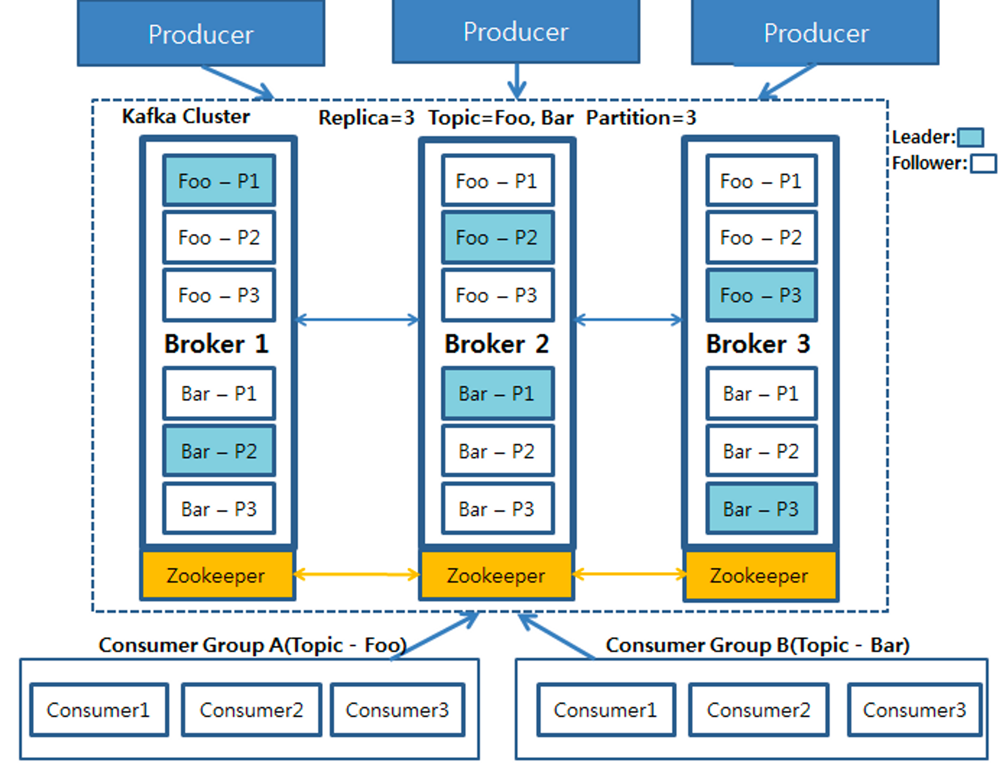
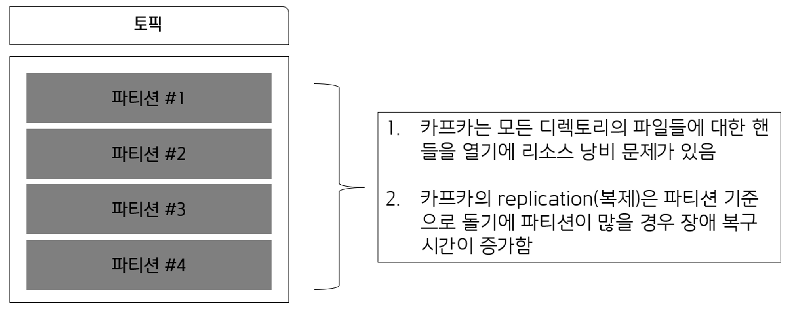

# Kafka 기본 정리

# 카프카란?

분산 스트리밍 플랫폼.대용량의 실시간 로그 처리에 특화되어 있는 솔루션이며, 데이터 유실없이 안전하게 전달하는 것이 주목적인 MQ 메시지 시스템에서 Fault-Tolerant(장애 허용)한 안정적인 아키텍처와 빠른 퍼포먼스로 데이터를 처리 가능.

# 카프카의 특징

Publisher Subscriber 모델 : 데이터 큐를 중간에 두고 서로 간 독립적으로 데이터를 생산하고 소비. Publisher나 Subscriber가 죽을 시, 서로 간에 의존성이 없으므로 안정적으로 데이터를 처리할 수 있음. 또한 설정 역시 간단하게 할 수 있다는 장점.

고가용성 및 확장성 : 카프카는 클러스터로서 작동. 그러므로 Fault-tolerant (장애 허용)한 고가용성 서비스를 제공할 수 있고, 분산 처리를 통해 빠른 데이터 처리를 가능하게 함. 또한, 서버를 수평적으로 늘려 안정성 및 성능을 향상시키는 Scale-out이 가능.

디스크 순차 저장 및 처리 : 메시지를 메모리 큐에 적재하는 기존 메시지 시스템과 다르게 디스크에 순차적으로 저장.

장점 1.

서버에 장애가 나도 메시지가 디스크에 저장되어 있으므로 유실 걱정 X

장점 2.

디스크가 순차적으로 저장되어 있으므로 디스크 I/O가 줄어들어 성능이 빨라짐.

분산 처리 : 카프카는 파티션이란 개념을 도입하여 여러개의 파티션을 서버들에 분산시켜 나누어 처리할 수 있음. 이로서 메시지를 상황에 맞춰 빠르게 처리 가능.

카프카 클러스터를 중심으로 프로듀서와 컨슈머가 데이터를 push하고 pull 하는 구조.

Producer, Consumer는 각기 다른 프로세스에서 비동기로 동작하고 있음.

**Producer** : Kafka Cluster에 데이터 적재 (안에 적재된 데이터 - 레코드)

**Kafka Cluster** : 카프카 서버로 이뤄진 클러스터. 

- Broker : 카프카 서버
- Zookeeper : 분산 코디네이션 시스템.
카프카 브로커를 하나의 클러스터로 코디네이팅 하는 역할. Leader를 발탁하는 방식도 주키퍼가 제공.
- Topic : 카프카 클러스터에 데이터를 관리할 시 그 기준이 되는 개념. 토픽은 카프카 클러스터에서 여러개 만들 수 있으며, 하나의 토픽은 1개 이상의 Partition으로 구성됨.
- Partition : 각 토픽 당 데이터를 분산 처리하는 단위. 카프카에선 토픽 안에 파티션을 나눠 그 수대로 데이터를 분산처리.  카프카 옵션에서 지정한 replica의 수만큼 파티션이 각 서버들에게 복제됨.
- Leader Follower : 각 Partition당 복제된 파티션 중에서 하나의 리더가 선출됨. 이 리더는 모든 읽기, 쓰기 연산을 담당하게 됨. 리더를 제외한 나머지는 팔로워가 되고, 이 팔로워들은 단순히 리더의 데이터를 복사하는 역할만 함.

**Consumer Group** : 컨슈머의 집합을 구성하는 단위. 카프카에선 컨슈머 그룹으로서 데이터를 처리하며, 컨슈머 그룹 안의 컨슈머 수 만큼 파티션의 데이터를 분산처리하게 됨.

<aside>
💡 이 파티션들은 운영 도중 그 수를 늘릴 수 있지만 **절대 줄일 수 없습니다**. 
이 때문에 파티션을 늘리는 것은 신중하게 고려해서 결정해야될 문제가 됩니다.
또한, 파티션이 많다고 무조건 좋은게 아닙니다. 브로커가 다운됐을 경우 관리 포인트가 많아지고, 오래걸립니다. 왜냐하면 내부적으로 토픽단위로 관리하는 것이 아니라 토픽안에 있는 파티션 단위로 분산 처리를 하기 때문.

그리고 파티션이 많아지면 그만큼 파일 핸들러도 늘어나게 되어서 파티션이 많다고 무조건 좋다 볼 수 없습니다. 파티션은 필요한 만큼만 늘리는 것이 좋은데 예를 들어 현재 파티션 개수가 원하는 데이터를 충분히 처리하지 못할 때 파티션을 늘리는 것.

</aside>

**레코드** : timestamp, headers, key, value, offset으로 구성. 프로듀서가 생성한 레코드가 브로커로 전송되면 오프셋과 타임스탬프가 지정되어 저장.
브로커에 한번 적재된 레코드는 수정할 수 없고, 로그 리텐션 기간 또는 용량에 따라서만 삭제된다.
- timestamp : 스트림 프로세싱에서 활용하기 위한 시간을 저장하는 용도로 사용. Unix timestamp가 들어가며, 따로 설정하지 않으면 ProducerRecord 생성시간이 들어감.
- offset : 프로듀서가 생성한 레코드엔 존재하지 않으며, 0부터 1씩 증가. 컨슈머가 중복 처리를 방지하기 위한 목적으로 사용.
- headers : key,value 데이터를 추가할 수 있으며, 레코드 스키마 버전이나 포맷과 같이 데이터 프로세싱에 참고할만한 정보를 담아서 사용.
- key : 메시지 값의 분류를 위한 용도(파티셔닝). 파티셔닝에 사용하는 메시지 키는 파티셔너에 따라 토픽의 파티션 번호가 정해짐.
메시지 키는 필수 값이 아니며, 지정하지 않으면 null로 설정. 메시지 키가 null인 레코드는 특정 토픽의 파티션에 라운도 로빈으로 전달. 
null이 아닌 메시지 키는 해쉬값에 의해서 특정 파티션에 매핑되어 전달됨.
- value : 실질적으로 처리할 데이터가 담기는 공간. 포맷은 제네릭으로 사용자에 의해 지정.
다양한 형태로 지정 가능하며, 필요에 따라 사용자 지정 포맷으로 직렬화/역직렬화 클래스를 만들어 사용할 수도 있다.
브로커에 저장된 레코드의 메시지 값은 어떤 포맷으로 직렬화되어 저장되어 있는지 알 수 없기 때문에 컨슈머는 미리 역직렬화 포맷을 알고 있어야 한다.

  

