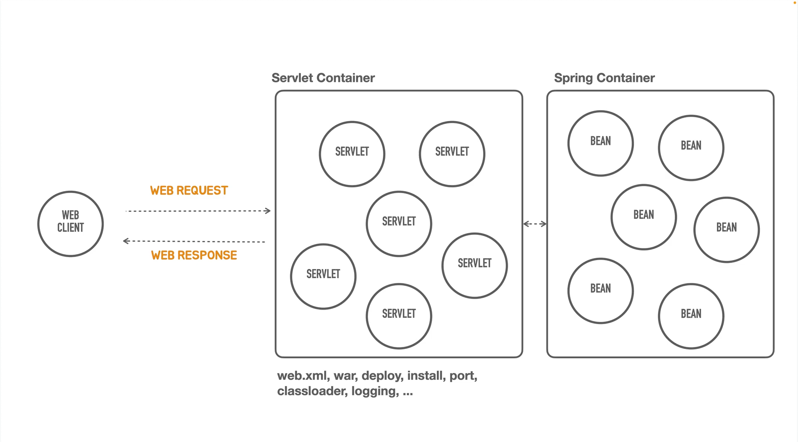

# 컨테이너리스(Containerless) 웹 애플리케스이션 개발이란?

## Container란?
- Web Container(Servlet Container)
- Web Component(Servlet)의 라이프 사이클 관리 
- Component 관리 
- Web Request의 Component 요청 처리 결정 (Routing, Mapping)

